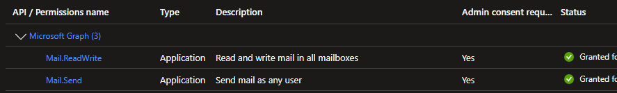
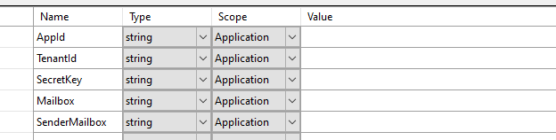
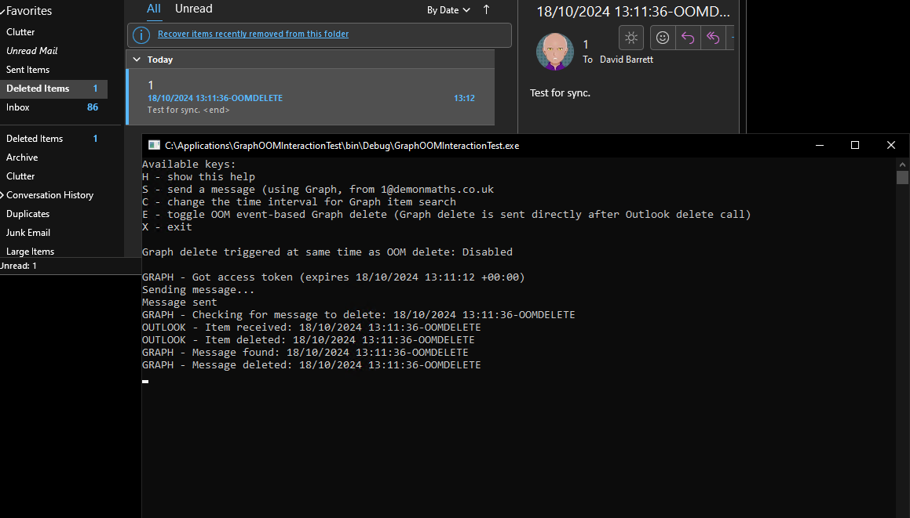

# GraphOOMInteractionTest

## Summary

This console application shows how client synchronisation can cause unexpected results in a mailbox.  In this example, a message is deleted via Microsoft Graph, but is still present in the mailbox.  The issue occurs when an action is taken on the same item in both Outlook and the online mailbox.  Depending upon the timing, the Outlook action will take precedence.

## Configuration

The application was written using Visual Studio 2022 with .Net Framework 4.8.  It uses the Outlook Object Model to interact with Outlook, and also interacts directly with the mailbox using Graph.  The application must be run on a machine with Outlook installed and a profile configured that is connected (in cached mode) to the same mailbox that is accessed via Graph.

For the Graph calls to work, an application must be registered in Azure Active Directory with the necessary permissions (Mail.ReadWrite and Mail.Send Application role):

Detailed instructions [here](https://learn.microsoft.com/en-us/graph/auth-register-app-v2?view=graph-rest-1.0).

Once the application is registered and consented, the details should be added to the application settings in Visual Studio:

Mailbox should be the same mailbox as configured in Outlook.  SenderMailbox should be a different mailbox (which will be used to send test messages to Mailbox).

## Process

The process to reproduce a synchronisation issue involves two clients acting on the mailbox.  In this case, the two clients are Outlook and Graph.

To trigger the issue:
1. An email is sent into the mailbox.
1. An action is taken on that email from two different clients.
	1. User deletes the item in Outlook (which moves the item to Deleted Items)
	1. Another client performs a hard delete on the item using Graph (this moves the item to mailbox Retention)

The result on the mailbox depends upon the timing of the actions taken by the client.  If Outlook moves the item to Deleted Items before it has received a notification from the mailbox that it is deleted, then the item will remain in Deleted Items (as Graph deleted the copy that is in the Inbox).

## Testing

- Open Outlook and show the Deleted Items folder.
- Run the console application.
- Press S to send a message.  This will cause the console application to send a message from SenderMailbox to Mailbox using Graph.
- As soon as the message is detected in the mailbox (via OOM), the console application will delete it from Outlook and also send a Graph request to delete the item from the mailbox.  This usually (but not always) results in Outlook "winning".

